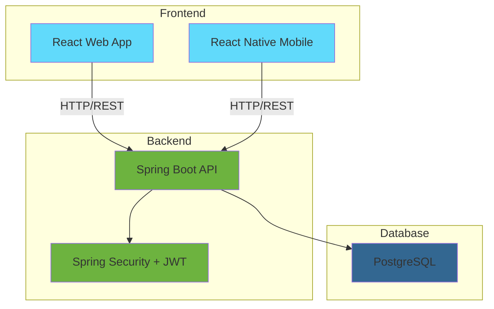

# 🚀 Sistema de Gestão de Skills

<div align="center">


**Plataforma completa para gerenciamento de habilidades técnicas dos usuários**

[🎯 Funcionalidades](#-funcionalidades) • [🛠️ Tecnologias](#️-tecnologias) • [🚀 Como Executar](#-como-executar) • [📋 API](#-documentação-da-api)

</div>

---

## 📋 **Sobre o Projeto**

O **Sistema de Gestão de Skills** é uma aplicação full-stack completa que permite aos usuários gerenciar suas habilidades técnicas, definindo níveis de conhecimento de 1 a 10 para cada tecnologia. A solução oferece uma experiência integrada através de três plataformas:

- 🖥️ **Backend API** - Spring Boot com JWT
- 🌐 **Frontend Web** - React com Vite  
- 📱 **Mobile App** - React Native com Expo

## 🎯 **Funcionalidades**

### 🔐 **Autenticação Segura**
- ✅ Sistema de login/registro com JWT
- ✅ Armazenamento seguro de tokens
- ✅ Proteção de rotas e endpoints
- ✅ Persistência de sessão

### 📊 **Gestão de Skills**
- ✅ **CREATE** - Adicionar novas skills ao perfil
- ✅ **READ** - Visualizar todas as skills do usuário
- ✅ **UPDATE** - Alterar nível de conhecimento (1-10)
- ✅ **DELETE** - Remover skills do perfil

### 🎨 **Interface Profissional**
- ✅ Design responsivo e moderno
- ✅ Feedback visual (loading, success, error)
- ✅ Componentes reutilizáveis
- ✅ Ícones SVG das tecnologias
- ✅ Navegação intuitiva

### 📱 **Mobile Experience**
- ✅ App nativo com React Native
- ✅ Interface otimizada para mobile
- ✅ Gestos e navegação mobile-friendly
- ✅ Armazenamento seguro de dados

## 🛠️ **Tecnologias**

### 🖥️ **Backend**
```
🔹 Spring Boot 3.5.4
🔹 Spring Security + JWT
🔹 Spring Data JPA
🔹 PostgreSQL / H2
🔹 Maven
🔹 Java 17
```

### 🌐 **Frontend Web**
```
🔹 React 18.3.1
🔹 Vite 6.0.1
🔹 JavaScript ES6+
🔹 CSS3 + Modules
🔹 Axios HTTP Client
🔹 React Router DOM
```

### 📱 **Mobile**
```
🔹 React Native 0.76.5
🔹 Expo 53.0.20
🔹 TypeScript 5.8.3
🔹 React Navigation 7.x
🔹 React Native SVG
🔹 Expo Secure Store
```

### 🗄️ **Banco de Dados**
```
🔹 PostgreSQL (Produção)
🔹 H2 Database (Desenvolvimento)
🔹 JPA/Hibernate ORM
🔹 Sequences para Auto Increment
🔹 Constraints e Relacionamentos
```

## 🏗️ **Arquitetura do Sistema**



## 🗄️ **Modelo do Banco de Dados**

```sql
┌─────────────────┐     ┌─────────────────┐     ┌─────────────────┐
│     USUARIO     │     │  USUARIO_SKILL  │     │      SKILL      │
├─────────────────┤     ├─────────────────┤     ├─────────────────┤
│ id (PK)         │◄────┤ id (PK)         │────►│ id (PK)         │
│ nome            │     │ usuario_id (FK) │     │ nome            │
│ email (UNIQUE)  │     │ skill_id (FK)   │     │ imagem_url      │
│ senha           │     │ level (1-10)    │     │ descricao       │
│ data_cadastro   │     └─────────────────┘     └─────────────────┘
└─────────────────┘
```

## 🚀 **Como Executar**

### 📋 **Pré-requisitos**
```bash
✅ Java 17+
✅ Node.js 18+
✅ PostgreSQL 12+
✅ Git
✅ Android Studio (para mobile)
```

### 1️⃣ **Clone o Repositório**
```bash
git clone https://github.com/oliveirap11/Desafio-Neki.git
cd Desafio-Neki
```

### 2️⃣ **Configuração do Banco de Dados**
```bash
# Criar banco PostgreSQL
createdb sistemaskill

# Executar script de criação
psql -d sistemaskill -f SistemaSkill.sql
```

### 3️⃣ **Backend (Spring Boot)**
```bash
cd BackEnd/Neki

# Configurar application.properties
spring.datasource.url=jdbc:postgresql://localhost:5432/sistemaskill
spring.datasource.username=seu_usuario
spring.datasource.password=sua_senha

# Executar aplicação
./mvnw spring-boot:run

# Servidor disponível em: http://localhost:8080
```

### 4️⃣ **Frontend Web (React)**
```bash
cd Frontend/desafio-neki

# Instalar dependências
npm install

# Configurar API URL no arquivo api.jsx
const BASE_URL = 'http://localhost:8080';

# Executar aplicação
npm run dev

# Aplicação disponível em: http://localhost:3000
```

### 5️⃣ **Mobile (React Native)**
```bash
cd Mobile/neki-mobile

# Instalar dependências
npm install

# Configurar IP do backend em src/services/api.ts
const BASE_URL = 'http://SEU_IP:8080';

# Executar no Android
npx expo run:android

# Ou usar Expo Go
npx expo start
```

## 📋 **Documentação da API**

### 🔐 **Autenticação**

#### `POST /api/auth/login`
```json
{
  "email": "user@email.com",
  "senha": "password"
}
```

#### `POST /api/auth/register`
```json
{
  "nome": "Nome Completo",
  "email": "user@email.com",
  "senha": "password",
  "confirmarSenha": "password"
}
```

### 🎯 **Skills**

#### `GET /api/skills`
```json
[
  {
    "id": 1,
    "nome": "JavaScript",
    "imagemUrl": "https://cdn.svg",
    "descricao": "Linguagem de programação"
  }
]
```

### 👤 **User Skills**

#### `GET /api/users/skills`
```json
[
  {
    "id": 1,
    "skill": {
      "id": 1,
      "nome": "JavaScript",
      "imagemUrl": "https://cdn.svg"
    },
    "level": 8
  }
]
```

#### `POST /api/users/skills`
```json
{
  "skillId": 1,
  "level": 5
}
```

#### `PUT /api/users/skills/{id}`
```json
{
  "level": 8
}
```

#### `DELETE /api/users/skills/{id}`

### 📊 **Headers Necessários**
```
Authorization: Bearer {jwt_token}
Content-Type: application/json
```

## 🧪 **Dados de Teste**

### 👤 **Usuário Administrador**
```
Email: admin@sistemaskill.com
Senha: admin123
```

### 🛠️ **Skills Pré-cadastradas**
```
• JavaScript, TypeScript, React, React Native
• Vue.js, Angular, Node.js, Python
• Java, Spring Boot, PostgreSQL, MySQL
• MongoDB, Docker, Git, AWS
• E mais 10+ tecnologias...
```

## 📁 **Estrutura do Projeto**

```
Desafio-Neki/
├── 📂 BackEnd/Neki/                 # Spring Boot API
│   ├── 📂 src/main/java/desafio/Neki/
│   │   ├── 📂 controller/           # REST Controllers
│   │   ├── 📂 entity/              # JPA Entities
│   │   ├── 📂 repository/          # Data Repositories
│   │   ├── 📂 service/             # Business Logic
│   │   ├── 📂 security/            # JWT Security
│   │   └── 📂 dto/                 # Data Transfer Objects
│   └── 📂 src/main/resources/      # Configurations
│
├── 📂 Frontend/desafio-neki/        # React Web App
│   ├── 📂 src/
│   │   ├── 📂 components/          # Reusable Components
│   │   ├── 📂 pages/               # Page Components
│   │   ├── 📂 contexts/            # React Context
│   │   └── 📂 api/                 # HTTP Client
│   └── 📄 package.json
│
├── 📂 Mobile/neki-mobile/           # React Native App
│   ├── 📂 src/
│   │   ├── 📂 components/          # UI Components
│   │   ├── 📂 screens/             # App Screens
│   │   ├── 📂 services/            # API Services
│   │   ├── 📂 context/             # Global State
│   │   └── 📂 types/               # TypeScript Types
│   └── 📄 package.json
│
├── 📄 SistemaSkill.sql             # Database Schema
└── 📄 README.md                    # This file
```

## 🔧 **Funcionalidades Técnicas**

### 🛡️ **Segurança**
- ✅ **JWT Authentication** com refresh automático
- ✅ **CORS** configurado para múltiplos origins
- ✅ **Senhas criptografadas** com BCrypt
- ✅ **Validação de dados** no backend e frontend
- ✅ **Proteção de rotas** em todas as plataformas

### 📊 **Performance**
- ✅ **Lazy Loading** de componentes
- ✅ **Caching** de dados frequentes
- ✅ **Índices otimizados** no banco de dados
- ✅ **Compressão** de assets
- ✅ **Bundle splitting** no frontend

### 🎨 **UX/UI**
- ✅ **Design responsivo** para todas as telas
- ✅ **Loading states** em todas as operações
- ✅ **Error handling** com feedback visual
- ✅ **Animations** suaves e profissionais
- ✅ **Acessibilidade** seguindo padrões WCAG

## 🧪 **Testes**

### 🔍 **Como Testar**

1. **Cadastro de Usuário:**
   - Acesse a tela de registro
   - Preencha os dados válidos
   - Confirme o cadastro

2. **Login:**
   - Use as credenciais criadas ou admin
   - Verifique redirecionamento para home

3. **Gestão de Skills:**
   - Adicione uma nova skill
   - Altere o nível de conhecimento
   - Remova uma skill

4. **Persistência:**
   - Faça logout e login novamente
   - Verifique se os dados permanecem

## 🤝 **Contribuição**

1. Faça o **fork** do projeto
2. Crie uma **branch** para sua feature (`git checkout -b feature/AmazingFeature`)
3. **Commit** suas mudanças (`git commit -m 'Add some AmazingFeature'`)
4. **Push** para a branch (`git push origin feature/AmazingFeature`)
5. Abra um **Pull Request**

## 🏆 **Destaques do Projeto**

### ✨ **Pontos Fortes**
- 🎯 **Arquitetura Completa** - Backend, Web e Mobile integrados
- 🛡️ **Segurança Robusta** - JWT + validações + constraints
- 📱 **Mobile First** - App nativo com excelente UX
- 🗄️ **Banco Bem Modelado** - Relacionamentos e constraints corretos
- 🎨 **Interface Profissional** - Design limpo e moderno
- 🚀 **Performance Otimizada** - Boas práticas implementadas
- 📚 **Código Limpo** - Arquitetura bem estruturada
- 🔧 **Facilmente Extensível** - Preparado para novas features

### 🛠️ **Tecnologias Modernas**
- ✅ Spring Boot 3.5.4 (mais recente)
- ✅ React 18 com hooks modernos
- ✅ TypeScript para type safety
- ✅ React Native com Expo
- ✅ PostgreSQL com constraints avançadas
- ✅ JWT para autenticação stateless

## 📝 **Licença**

Este projeto está sob a licença MIT. Veja o arquivo [LICENSE](LICENSE) para mais detalhes.

## 👨‍💻 **Desenvolvedor**

**Patrick Oliveira**
- GitHub: [@oliveirap11](https://github.com/oliveirap11)
- LinkedIn: [Patrick Oliveira](https://www.linkedin.com/in/patrick-dos-santos-oliveira-120211271/)

---

<div align="center">

**⭐ Se este projeto te ajudou, deixe uma estrela! ⭐**

Made with ❤️ by [Patrick Oliveira](https://github.com/oliveirap11)

</div>
